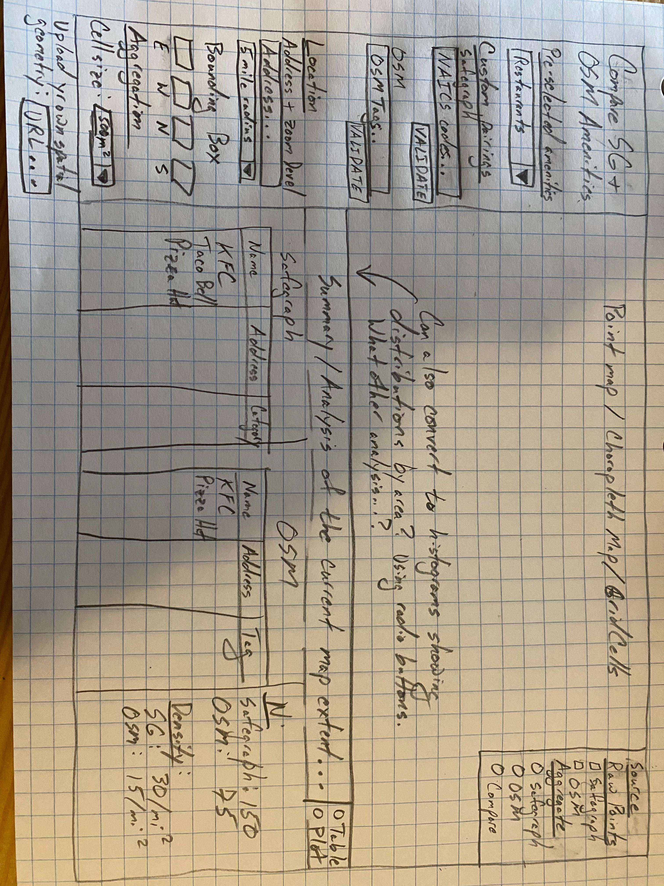

# Project Proposal

**Team Members:** Bingchu Chen, Eugene Chong

## Abstract

The [SafeGraph Core Places](https://docs.safegraph.com/v4.0/docs#section-core-places) dataset and the amenities recorded in OpenStreetMap are two very different sources of point-of-interest data. SafeGraph's data is proprietary and highly curated. The company charges a fee for access to the data, maintains numerous attributes for each POI (with [impressive fill rates](https://docs.safegraph.com/v4.0/docs/places-summary-statistics)), and publishes updated versions of the data monthly. OpenStreetMap, on the other hand, is free and entirely crowd-sourced. While OSM's mapping community attempts to maintain standards for the data listed on OpenStreetMap, and corporate contributors have employees whose primary job is to update the map, OSM's data can vary significantly in completion and accuracy, depending on feature being mapped and the location.

For our project, we’re interested in creating a tool that will allow users to compare the POI data coverage of the SafeGraph Core Places dataset and the amenities recorded in OpenStreetMap. For example, a user could query “coffeeshops in Philadelphia”, and the app would return two maps - one displaying the Philadelphia coffeeshops listed in SafeGraph, and another with the coffeeshops from OSM - along with relevant summary statistics. The user could also use the app to aggregate the coffeeshops to some geographic unit of analysis (TBD) to identify where the data sources differ most in their coverage.

We have two use cases in mind:

1.	The primary use case is for contributors to OpenStreetMap who need assistance identifying gaps in local OSM amenity coverage. If a local mapper has taken up the cause of mapping all of the restaurants in a given city, they could use this tool to identify the areas of the city that require more mapping attention.

2.	A secondary use case is for organizations that are interested in performing geospatial analyses with POI data but are unsure if they need to pay for expensive data from SafeGraph. This tool would help these organizations compare the datasets in their area of interest and get a sense of how much additional value the SafeGraph data would provide.

## Data Sources

1.	**SafeGraph Core Places:**

	* **Access:** Yes, through the SafeGraph COVID-19 Data Consortium
	* **Size of Dataset:** Nationwide, approximately 6MM rows
	* **How to host:** to-be-discussed with Andy

2.	**OpenStreetMap:**

	* **Access:** Yes, through BigQuery
	* **Size of Dataset:** N/A
	* **How to host:** BigQuery

## Wireframes / Mock-ups

Below is a wireframe of the main mapping page.

**Left panel:**
* Users can choose from a drop-down of pre-selected amenities. For instance, the `Restaurants` pair would load a query that selects restaurants from SafeGraph using the appropriate NAICS code and restaurants from OSM using the appropriate OSM tag.
* Users could also enter their own NAICS codes and OSM tags to perform a custom comparison, since there isn't necessarily a 1-to-1 mapping between NAICS and OSM tags. This would ideally be some sort of form where users enter one code at a time, validate it to confirm it exists in the relevant dataset, see it pop up above the field, and click an "x" to remove it if they change their minds.
* Three options for a location field:
	+ An address for the center, with a drop-down of radii that roughly correspond to Mapbox zoom levels
	+ A bounding box where users enter coordinates.
	+ These get ignored if the user supplies their own spatial geometry below.
* Units of aggregation. Users may want to data aggregated to some level rather than the raw points. Two options:
	+ Cell sizes. For computation speed, these would need to be filtered in some way to match the bounding box, so that users don't use too small a unit of analysis over too large an area.
	+ Upload a custom set of geometries. Ideally users could upload or link to something like a neighborhoods geojson. But this seems tricky.

**Map panel:**
* An interactive map that starts at the user's location.  Users can zoom out, but the data shown will probably need to be limited to just what fit in the original extent, but it'd be cool to download more data dynamically if it isn't too slow.
* Using the control panel on the right, users can select which dataset(s) to display as raw points. 
* They could also switch to an aggregate map using the radio buttons. The map would flip to maps with the chosen grid cells (or the user-uploaded geometries). If they select Safegraph or OSM, the mapped values would just be raw counts. If they select "Compare", it would show which areas have more or less data from Safegraph or OSM.

**Summary / Analysis panel:**
* Users can switch between Tables and Plots with radio buttons (or maybe tabs).
* The Table view would show the amenities from the Safegraph and OSM data. Ideally, these tables would update dynamically to show only the locations in the current extent of the map.
* At the right right, we'd have some summary statistics, like overall counts, density, and...
* The plots view would show (at least) two plots:
	+ Histogram showing overall distribution of the amenities by grid cell/geography
	+ Paired bar charts showing the count of amenities in a given area by the source. Ideally a user could click or highlight a bar and see it on the map.
* Open to any suggestions you have, Andy, for additional analyses!

